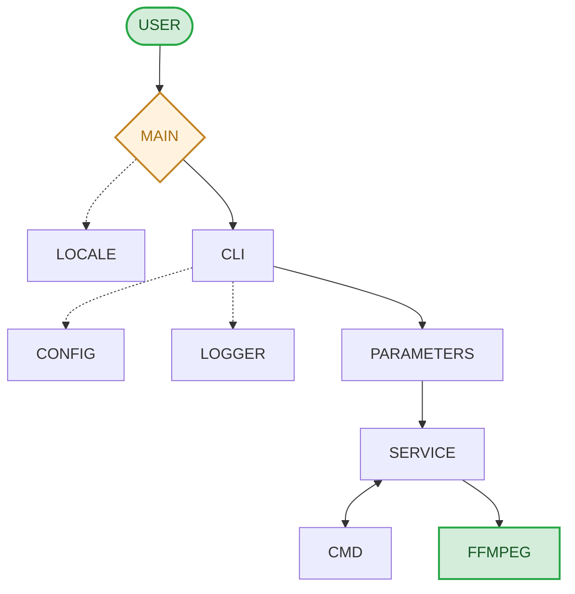

# pyMedia

Aplicación CLI que actúa como handler sencillo de comandos `ffmpeg` para tareas
habituales de procesamiento de vídeo: análisis de metadatos, capturas, unión,
corte y división de contenedores, remux sin transcodificar, transcodificación
por perfiles y edición de pistas de audio y subtítulos.

> **Versión:** Beta 0.21.0

## Características

- **Información** de metadatos de vídeo (`info`) y hojas de capturas (`sheet`).
- **Grandes operaciones sin pérdida**: remux de contenedor (`remux`), unión
  (`join`) y corte/división (`cut`) con `-c copy`.
- **Transcodificación** (`transcode`) con perfiles editables en `config.toml`,
  códecs H.264/H.265/AV1 y AAC/E-AC-3/Opus, y filtros de escalado, recorte,
  rotación y volteo.
- **Pistas de audio** (`add-audio`, `delete-audio`, `edit-audio`, `extract-audio`)
  y **subtítulos** (`add-subs`, `delete-subs`, `edit-subs`, `extract-subs`) con
  metadatos de idioma, título, _default_, _forced_, etc.
- **Capturas**: fotogramas en marcas concretas (`frames`), por intervalos
  (`interval`) o por cambios de escena (`scene`).
- **Imágenes animadas**: conversión de fragmentos de vídeo a imágenes animadas (`animated`).
- **Barra de progreso** de Rich y detección de bloqueos de ffmpeg
  (`stall_timeout`).
- **Multilingüe**: interfaz en inglés y español (gettext).

## Requisitos

- Python **3.12 o superior** para ejecución desde el código fuente.
- **ffmpeg** y **ffprobe** instalados y disponibles en el `PATH`.

  - Windows: `winget install ffmpeg` o <https://ffmpeg.org/download.html>
  - Debian/Ubuntu: `sudo apt install ffmpeg`

## Instalación

### Desde el código fuente

```bash
git clone https://github.com/isidro-rodriguez/pyMedia.git
cd pyMedia
uv sync
uv run pymedia --help
```

También puedes instalar la aplicación como comando `pymedia`:

```bash
uv tool install .
```

### Ejecutable único (Windows)

```bash
uv run python scripts/build_windows.py
```

Compila con pyInstaller un único `build/pymedia.exe` con icono incluido.

## Uso rápido

```bash
pymedia --help
pymedia --version    # muestra versión, Python y plataforma y sale
pymedia <comando> --help     # ayuda detallada de cada comando
```

| Comando         | Ejemplo                                                           |
|-----------------|-------------------------------------------------------------------|
| `info`          | `pymedia info input.mp4`                                          |
| `sheet`         | `pymedia sheet input.mp4 --preset fhd -o vcs.webp`                |
| `transcode`     | `pymedia transcode source.mp4 --preset slow --video --audio 1`    |
| `remux`         | `pymedia remux input.mp4 -o output.mkv`                           |
| `join`          | `pymedia join part1.mp4 part2.mp4 -o movie.mp4`                   |
| `cut`           | `pymedia cut input.mp4 --at 10:05,40:30,1:20:00`                  |
| `add-audio`     | `pymedia add-audio input.mp4 audio.m4a`                           |
| `delete-audio`  | `pymedia delete-audio input.mp4 --tracks 1,2`                     |
| `edit-audio`    | `pymedia edit-audio input.mp4 --track 0 --forced --default`       |
| `extract-audio` | `pymedia extract-audio input.mp4 -o audio.m4a`                    |
| `add-subs`      | `pymedia add-subs input.mp4 subs_es.srt --language spa --default` |
| `delete-subs`   | `pymedia delete-subs input.mp4 --tracks 1,2`                      |
| `edit-subs`     | `pymedia edit-subs input.mp4 --track 0 --forced --default`        |
| `extract-subs`  | `pymedia extract-subs input.mp4 --tracks 3,5 -o subs.srt`         |
| `animated`      | `pymedia animated input.mp4 --start 00:00:05 --end 00:00:12`      |
| `frames`        | `pymedia frames input.mp4 --at 00:01:30,00:05:15`                 |
| `interval`      | `pymedia interval input.mp4 --every 5 --start 00:00:10`           |
| `scene`         | `pymedia scene input.mp4 --scene 0.3`                             |

## Comandos

### Análisis

| Comando | Acción                                                                  |
|---------|-------------------------------------------------------------------------|
| `info`  | Muestra los metadatos del fichero multimedia (códecs, pistas, tamaño…). |
| `sheet` | Genera una cuadrícula de fotogramas con cabecera de metadatos.          |

### Vídeo

| Comando     | Acción                                                                                         |
|-------------|------------------------------------------------------------------------------------------------|
| `transcode` | Transcodifica audio y/o vídeo con un perfil de `config.toml`, aplicando los filtros indicados. |
| `remux`     | Cambia de contenedor sin transcodificar.                                                       |
| `join`      | Une varios vídeos consecutivamente en un único contenedor (_mínimo 2_).                        |
| `cut`       | Recorta una sección o divide el vídeo por marcas de tiempo.                                    |

### Audio

| Comando         | Acción                                                                                                   |
|-----------------|----------------------------------------------------------------------------------------------------------|
| `add-audio`     | Añade una pista de audio al contenedor (hereda metadatos y disposiciones del archivo origen).            |
| `delete-audio`  | Elimina pistas (`--tracks 1,2`).                                                                         |
| `edit-audio`    | Edita metadatos de la pista `--track N` (idioma, título, default, forced, commentary, hearing-impaired). |
| `extract-audio` | Extrae pistas a fichero de audio independiente (`--tracks` por defecto todas).                           |

> El idioma se indica con `--language <código ISO 639-2>` (p. ej. `eng`, `spa`) solo en `edit-audio`.

### Subtítulos

| Comando        | Acción                                                                |
|----------------|-----------------------------------------------------------------------|
| `add-subs`     | Añade una pista de subtítulos (`.srt`, `.ass`, `.ssa`) al contenedor. |
| `delete-subs`  | Elimina pistas (`--tracks 3,4,5`), sin `--tracks` elimina todas.      |
| `edit-subs`    | Edita metadatos de la pista `--track N` (+ `--visual-impaired`).      |
| `extract-subs` | Extrae pistas a fichero de subtítulos independiente.                  |

### Imagen

| Comando    | Acción                                                                                      |
|------------|---------------------------------------------------------------------------------------------|
| `animated` | Convierte un fragmento de vídeo en imagen animada (`--start`, `--end`, `--fps` 4–20).       |
| `frames`   | Captura fotogramas en marcas concretas (`--at hh:mm:ss,...`).                               |
| `interval` | Captura fotogramas a intervalos regulares (`--every N` segundos, opcional `--start/--end`). |
| `scene`    | Captura fotogramas en los cambios de escena (`--scene` sensibilidad 0.1–0.5).               |

### Opciones comunes

La ayuda de cada comando está localizada y se muestra con `--help`.

| Opción              | Descripción                                                                           |
|---------------------|---------------------------------------------------------------------------------------|
| `-o`, `--output`    | Ruta del fichero de salida.                                                           |
| `-d`, `--directory` | Directorio de salida para procesar lotes de ficheros (con `output` son excluyentes).  |
| `--overwrite`       | Política ante un fichero de salida existente: `yes`, `no`, `ask` (por defecto `ask`). |
| `--debug`           | Activa el nivel de log DEBUG.                                                         |
| `--show-cmd`        | Muestra el comando ffmpeg compuesto y sale sin ejecutar                               |
| `--version`         | Muestra la versión, Python y plataforma en un panel Rich y sale.                      |

### Filtros disponibles

| Opción              | Descripción                                                               |
|---------------------|---------------------------------------------------------------------------|
| `--crop`            | Recorta a `WIDTH,HEIGHT` desde la coordenada `X,Y`: `--crop 640,360,0,0`. |
| `--rotate`          | Giro ortogonal: `--rotate 90\|180\|270`.                                  |
| `--size`            | Resolución objetivo: `--size WIDTHxHEIGHT`.                               |
| `--mode`            | Política de escalado: `fit` (por defecto), `stretch`, `cover`.            |
| `--upscale`         | Permite ampliar más allá de las dimensiones de origen.                    |
| `--hflip` `--vflip` | Invierte la imagen horizontal / verticalmente.                            |

## Configuración

La configuración persistente se copia al directorio de configuración del
usuario en el primer arranque y se lee en cada ejecución:

| Plataforma | Ruta                                                |
|------------|-----------------------------------------------------|
| Windows    | `%APPDATA%\pymedia\config.toml`                     |
| Linux      | `~/.config/pymedia/config.toml`                     |
| macOS      | `~/Library/Application Support/pymedia/config.toml` |

```toml
[app]
language = "system"        # system | spanish | english
stall_timeout = 60         # segundos (30–600) para matar ffmpeg si se bloquea

[default_containers]
animated_image = ".gif"
audio_track = ".m4a"
image = ".jpg"
media = ".mp4"
subtitles = ".srt"

[transcode]

[transcode.fast]           # velocidad
video_codec = "h265"
video_preset = "veryfast"
video_crf = 25
audio_codec = "aac"
audio_bit_rate = "160k"

[transcode.even]           # equilibrado
video_codec = "h265"
video_preset = "medium"
video_crf = 23
audio_codec = "aac"
audio_bit_rate = "192k"

[transcode.slow]           # máxima compresión
video_codec = "h265"
video_preset = "slower"
video_crf = 20
audio_codec = "aac"
audio_bit_rate = "256k"
```

### Perfiles de transcodificación

| Perfil   | Vídeo | CRF |  Preset  | Audio | Bit rate | Contenedor |
|:---------|:-----:|:---:|:--------:|:------|---------:|:----------:|
| **fast** | H265  | 25  | veryfast | AAC   | 160 kb/s |    MP4     |
| **even** | H265  | 23  |  medium  | AAC   | 192 kb/s |    MP4     |
| **slow** | H265  | 20  |  slower  | AAC   | 256 kb/s |    MP4     |

Los valores de los perfiles son editables en `config.toml`, la clave `--preset`
de `transcode` los selecciona por nombre.

### Compatibilidad entre códecs y contenedores de vídeo

|      | AV1 | H.264 | H.265 | AAC | E-AC-3 | Opus | ASS | SRT | SSA |
|------|:---:|:-----:|:-----:|:---:|:------:|:----:|:---:|:---:|:---:|
| MKV  | ✓  |  ✓   |  ✓   | ✓  |   ✓   |  ✓  | ✓  | ✓  | ✓  |
| MP4  | ✓  |  ✓   |  ✓   | ✓  |   ✓   |  ⚠  |     | ⚠  |     |
| WebM | ✓  |       |       |     |        |  ✓  |     |     |     |

> ⚠ = Soporte según versión de ffmpeg/reproductor. Para subtítulos, MP4
> transcodifica `SRT` a `mov_text`.

### Compatibilidad entre códecs y contenedores de audio

|     | AAC | ALAC | FLAC | Opus | MP3 |
|-----|:---:|:----:|:----:|:----:|:---:|
| MKA | ✓  |  ✓  |  ✓  |  ✓  | ✓  |
| M4A | ✓  |  ✓  |      |  ⚠  |     |
| OGG |     |      |  ✓  |  ✓  | ⚠  |

> ⚠ = Soporte parcial/no universal, evitar si buscas compatibilidad amplia.

## Idiomas

Los mensajes utilizan gettext (msgid en inglés) y el idioma se detecta con la
prioridad: **PYMEDIA_LANG** → **config.toml** → **idioma del sistema** →
**inglés**.

- `app.language` en `config.toml` admite `system`, `spanish` o `english`
  (también cualquier alias: códigos ISO 639-1/639-2, nombre nativo).
- Catálogos en `src/pymedia/locales/` (`english` no traduce, `spanish` usa `.mo`).
- La variable de entorno `PYMEDIA_LANG` fuerza el idioma (código ISO 639-1
  `en`/`es`, código ISO 639-2 `eng`/`spa`, nombre nativo `English`/`Español`
  o nombre `english`/`spanish`) y
  tiene prioridad sobre `config.toml` y sobre el sistema; se resuelve antes de
  cargar la aplicación, por lo que también afecta a los textos de ayuda. Un
  valor desconocido se ignora.
- La variable de entorno `PYMEDIA_LOCALEDIR` permite sobreescribir el
  directorio de catálogos (útil en builds frozen).

## Registro (logging)

- **Consola**: Rich (con marcas y niveles de color).
- **Fichero**: `logging.log` en el directorio de configuración del usuario
  (el mismo que aloja `config.toml`), con marca de tiempo, nivel y mensaje.

## Desarrollo

Requisitos: Python 3.12+, `uv` y ffmpeg/ffprobe en `PATH`.

```bash
uv sync                     # instala dependencias y grupo dev
uv run ruff check .         # lint
uv run ruff format .        # formato
uv run pytest               # suite de tests (tests/)
uv run pytest -q -m binary  # Tests contra el binario compilado (lento)
```

La fixture `pymedia` ejecuta cada test como CLI en proceso (`[cli]`) y como binario compilado (`[binary]`). La marca `binary` se excluye por defecto.

### Traducciones (i18n)

```bash
uv run python scripts/i18n.py extract            # regenera pymedia.pot desde src/
uv run python scripts/i18n.py update -l es       # sincroniza es.po con el POT
uv run python scripts/i18n.py compile -l es      # compila pymedia.po -> pymedia.mo
uv run python scripts/i18n.py check              # valida POT y catálogos
uv run pytest -m locales
```

### Scripts

Scripts utilitarios ubicados en `scripts/`.

| Script                 | Descripción                                                          |
|------------------------|----------------------------------------------------------------------|
| `backup.py`            | Copia de seguridad de `src/`, `tests/` y `scripts/` en `local/`.     |
| `build.py`             | Compila `build/pymedia.exe` en Windows y `build/pymedia` en Linux.   |
| `code_count.py`        | Cuenta el número de líneas de código de la aplicación.               |
| `generate_fixtures.py` | Genera múltiples fixtures de vídeos, audio y subtítulos para testeo. |
| `i18n.py`              | Utilidades para la compilación de ficheros multi-lenguaje de Babel.  | 

## Estructura del proyecto

```shell
pyMedia/
├── src/pymedia/
│   ├── commands/         # Lógica de subcomandos de pyMedia
│   ├── data/             # Catálogos de códecs, contenedores, formatos y lenguas
│   ├── mixins/           # Mixins utilizados por los parámetros de los comandos
│   ├── models/           # Dataclasses de parámetros y mixins de validación
│   ├── commands/         # Cada comando CLI: cli, parameters, cmd, service
│   ├── locales/          # Catálogos gettext (pymedia.pot, es/)
│   ├── resources/        # config.toml, iconos, man page y .desktop
│   ├── ffprobe.py        # Herramienta Ffprobe para consulta de metadatos
│   ├── locale_manager.py # Detección/carga del idioma gettext
│   ├── logger.py         # Logging: consola Rich + fichero
│   ├── errors.py         # Jerarquía de excepciones localizadas
│   ├── types.py          # Enums y tipos compartidos
│   └── main.py           # Punto de entrada de la CLI
├── scripts/              # Build, i18n, backup y generadores de media
├── tests/                # Suite pytest
├── pyproject.toml        # Metadatos, dependencias y config de ruff/pytest
└── uv.lock
```

## Flujo de trabajo


